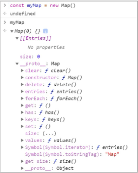
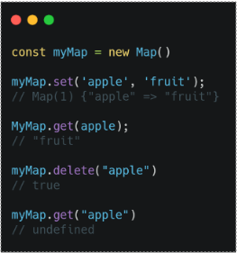
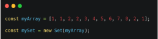
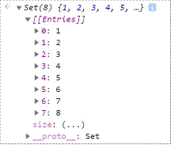
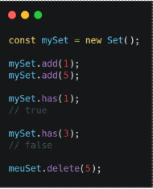

# Mapas e Conjuntos Com Javascript

## Estrutura Map

Características:
* Uma coleção de arrays no formato [chave, valor];
* Pode iterado por um loop for...of

## Métodos
Adicionar, ler e deletar

## Map vs Objeto
* Maps podem te chaves de qualquer tipo;
* Maps possuem a propriedade length;
* Maps são mais fáceis de iterar;
* Utilizado quando o valor das chaves é desconhecido;
* Os valores tem o mesmo tipo.

## Estrutura  Coleção Chaveada

Sets são estruturas que armazenam apenas valores únicos.

## Métodos
Adicionar, consultar e deletar

## Set vs Array
* Possui valores únicos;
* Em vez da propriedade length, consulta-se o número de registros pela propriedade size;
* Não possui os métodos map, filter, reduce etc.

