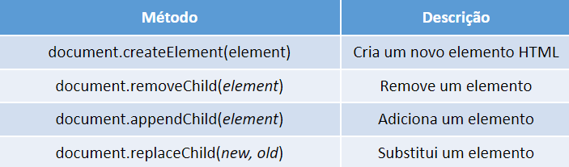

# Manipulando o DOM

## Document Object Model(DOM)
O DOM HTML é um padrão de como acessar e modificar os elementos HTML de página.


## Browser Object Model (BOM)
Tudo o que está dentro do objeto window.
* Window
    * document(DOM)
    * history
    * location
    * screen
    * navigation 


## Métodos
### Adicionar e Deletar


## Eventos
### Tipos
* Evento do mouse(mouseover, mouseout)
* Eventos de clique (click, dbclick)
* Evento de atualização(Change, load)

## Event Listener
Diretamente no Javascript, cria um evento que vai ser acionado no momento em que o usuário realizar determinada ação
```
const botao = document.getElementById("meuBotao");

botao.addEventListener("click", outraFuncao);
```
## Atributo HTML
Especifica a função a ser chamada diretamente no elemento HTML.
```
<h1 onclick="mudaTexto(this)">Clique aqui!</h1>
```


## Atividade: Light Mode/Dark Mode

1. Crie uma estrutura básica de projeto front-end (HTML, CSS e JS)
2. Copie o HTML e o CSS deste repositório
3. Crie um arquivo chamado `scripts.js` na sua pasta `assets/js`
4. Selecione os elementos: `h1`, `button`, `footer` e `body`
5. Se os elementos possuírem a classe `dark-mode`, modifique seus estilos. Caso contrário, volte os estilos para o original

## Exemplo


