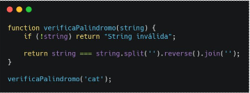
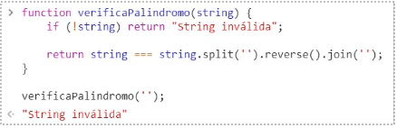
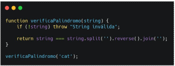
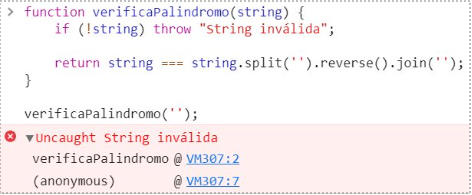
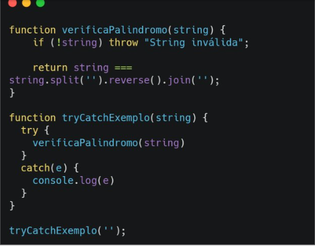
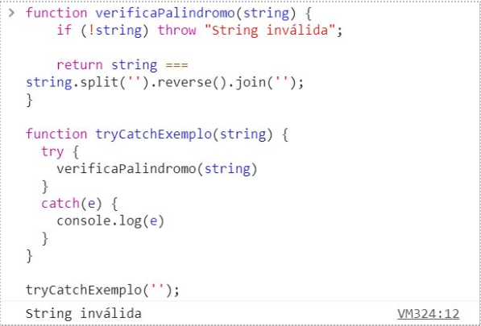
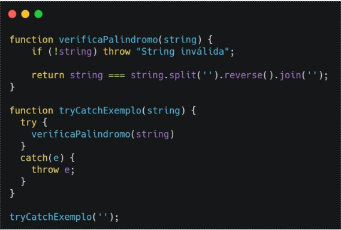
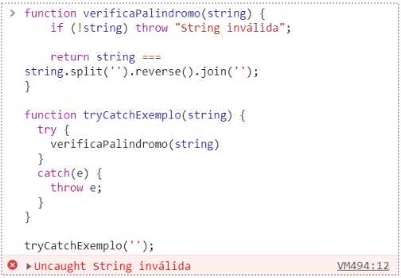

# Debugging e Error Handling com JavaScript
## Tipos de Erro

### Objetivo
1. Apresentar o objetivo Error do <strong>ECMAScript</strong>
2. Apresentar a <strong>DOMException</strong>

## ECMAScript Error Tratamento de erros

Erros que ocorrem em tempo de execução.

<strong>Composto por: </strong>

* Mensagem
* Nome
* Linha
* Call Stack

## DOMException Tratamento de erros

Erros relacionados ao document Object Model (DOM)

## Tratando Erros  tratamento de erros

### Objetivo
1.  Explicar a diferença entre "trhow" e "return"
2. Apresentar a implementação da declaração try/catch

## Throw

Lança uma exceção explicitamente  
throw new TipoDeExcecao("mensagem de erro");

<table>
  <tr>
    <td></td>
    <td></td>
  </tr>
  <tr>
    <td></td>
    <td></td>
  </tr>
</table>

## Try...Catch

Tenta executar o código no bloco try e captura exceções no bloco catch

<table>
  <tr>
    <td></td>
    <td></td>
  </tr>
  <tr>
    <td></td>
    <td></td>

  </tr>
</table>

## Finally

O bloco finally em Java é uma parte opcional de uma estrutura de tratamento de exceções que pode ser usada junto com try e catch. Ele é utilizado para executar um conjunto de instruções que devem ser executadas independentemente de uma exceção ser lançada ou não.

