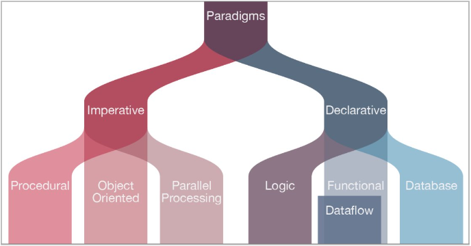
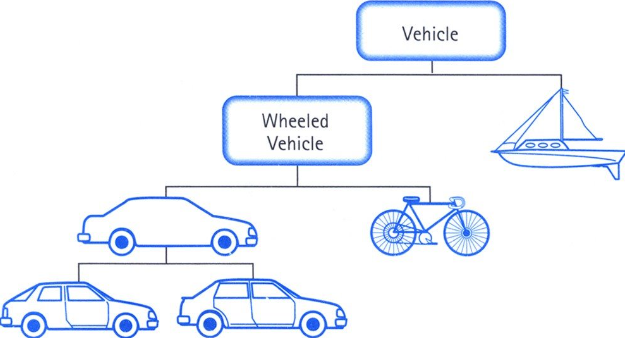
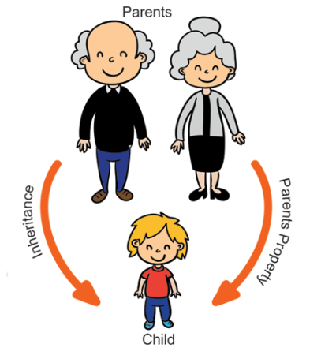
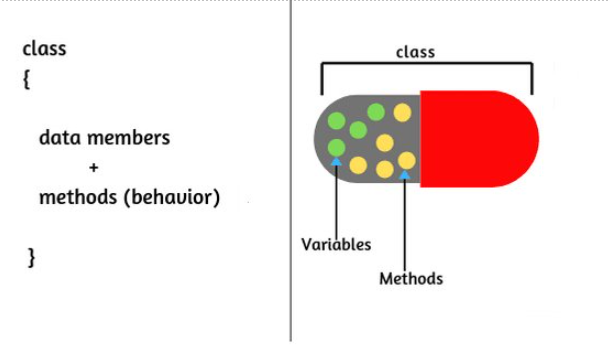
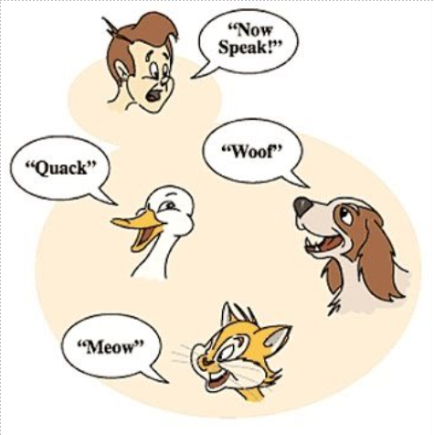

# Orientação a Objetos

## Paradigmas

 
Os programas são "objetos" que possuem uma série de propriedades.

 

`Pilares`
* Herança
* Polimorfismo
* Encapsulamento
* Abstração

### Abstração
"Processo mental que consiste em isolar um aspecto determinado de um estado de coisas relativamente complexo, a fim de simplificar a sua avaliação, classificação ou para permitir a comunicação do mesmo"
 

### Herança
"O objeto herda propriedades e métodos do objeto pai"
 

### Encapsulamento
"Cada classe tem propriedades e métodos independentes do restante do código."
 

### Polimorfismo
"Objeto podem herdar a mesma classe pai, mas se comportarem de forma diferente quando invocamos seus métodos"
 

## Atividade: Conta Bancária

Nesta atividade, vamos testar os conceitos de Orientação a Objetos simulando a criação de diversos tipos de contas bancárias e operações disponíveis em cada uma.

1. Crie a classe `ContaBancaria`, que possui os parâmetros `agencia`, `numero`, `tipo` e `saldo`;
2. Dentro de `ContaBancaria`, construa o getter e o setter de `saldo`;
3. Dentro de `ContaBancaria`, crie os métodos `sacar` e `depositar`;
4. Crie uma classe-filha chamada `ContaCorrente` que herda todos esses parâmetros e ainda possua o parâmetro `cartaoCredito`;
5. Ainda em `ContaCorrente`, construa o getter e o setter de `cartaoCredito`;
6. Ainda em `ContaCorrente`, faça com que o `tipo` seja 'conta corrente' por padrão;
7. Crie uma classe-filha chamada `ContaPoupanca` que herda todos os parâmetros de `ContaBancaria`;
8. Crie uma classe-filha chamada `ContaUniversitaria` que herda todos os parâmetros de `ContaBancaria`;
9. Faça com que o método `saque` de `ContaUniversitaria` apenas seja capaz de sacar valores **menores que 500 reais**.
